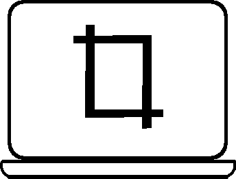
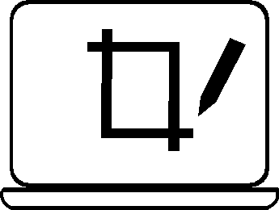
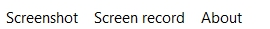

<h1>ScreenCap</h1>

ScreenCap is open source project that allows you to cature screen of your computer.

<h1>Functions</h1>

Project include these features:

<ul>
    <li>Full-screenshot</li>
        
        <ul>
            <li>will take full-screenshot and save it in selected folder with selected extension(.png on .jpg)</li>
        </ul>
</ul>

Features to be added :

<ul>
    <li>Screenshot of selected area</li>
    
    <ul>
            <li>will take selected area screenshot and save it in selected folder with selected extension(.png or .jpg)</li>
    </ul>
    <li>Screenshot of selected area with your cutomizations</li>
    
        <ul>
            <li>When you take a screenshot, the program opens an image editor that allows you to take notes on the screenshot and draw on it,then saves image in selected folder with selected extension(.png or .jpg)</li>
        </ul>
    <li>screen record</li>
    
    <ul>
        <li>opens window with screen recorder which allows you to record your screen,then saves video in selected folder with selected extension(.avi or .mp4 or .mkv)</li>
    </ul>
</ul>

Folders and extensions for screenshots and screen records can be selected in upper menubar

<h1>License</h1>
<h1>Written in Python 3.9 with Libs</h1>
<ul>
    <li>PyQt5</li>
    <li>PIL</li>
    <li>numpy</li>
    <li>cv2</li>
</ul>