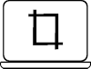
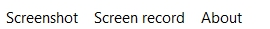

# ScreenCap
ScreenCap is open source project that allows you to cature screen of your computer.
# Functions
Project include these features:
- Full-screenshot

    

    - will take full-screenshot and save it in selected folder with selected extension(.png on .jpg)

Features to be added :
- Screenshot of selected area

    

    - will take selected area screenshot and save it in selected folder with selected extension(.png or .jpg)
- Screenshot of selected area with your cutomizations

    

    - When you take a screenshot, the program opens an image editor that allows you to take notes on the screenshot and draw on it,then saves image in selected folder with selected extension(.png or .jpg)
- screen record

    

    - opens window with screen recorder which allows you to record your screen,then saves video in selected folder with selected extension(.avi or .mp4 or .mkv)
    
Folders and extensions for screenshots and screen records can be selected in upper menubar

# License
GPL-3.0 License 
# Written in Python 3.9 with Libs
- PyQt5
- PIL
